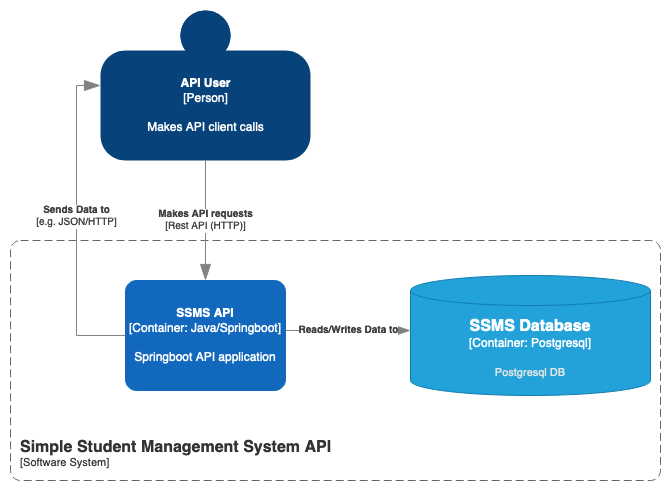
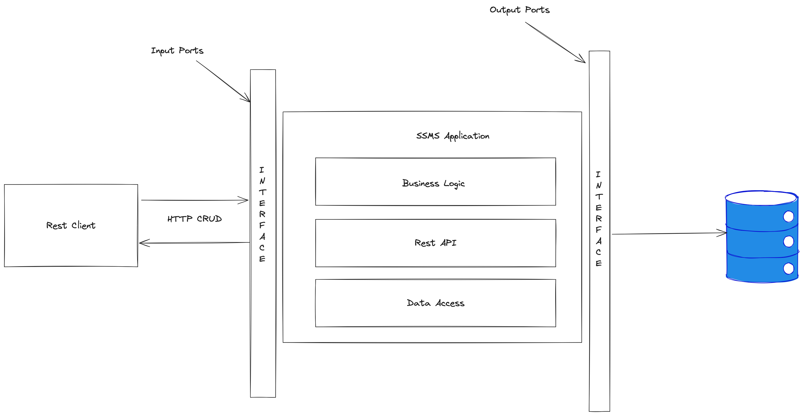
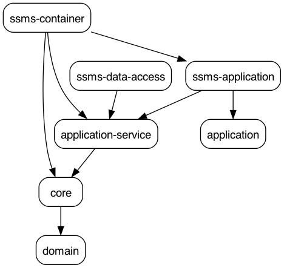

# SSMS API

Simple Student Management System to go through SRE bootcamp exercises. (https://playbook.one2n.in/sre-bootcamp/sre-bootcamp-exercises)

## Architecture Diagram

## Application Structure (Code)

## Hexagonal Architecture (Dependency Graph)

## Domain Driven Design

Aggregate Root: Student

Attributes: StudentID, StudentName, EmailAddress, EnrollmentDate

Methods
- initAddStudent()

ValueObjects
- StudentID
- StudentName
- EmailAddress

## Deployment
Local deployment is done using [tilt](https://tilt.dev) to run application in k8s locally (Docker Desktop for eg.).

Make sure you have docker desktop installed and kubernetes started. Change directory into the infrastructure folder
and kubernetes. Run `tilt up` to start application. This assumes you have a local PostgresDB running on port 5432
with username `ussms` and default password `ussms`. This can be changed using the `DB_USER` and `DB_PASS` env vars.
`DB_NAME` controls the database name. By default this is `ssms`.

To use the Makefile, simply make sure you have `make` installed and run

`make app` -- to start application (this checks if postgres is up and running before)

`make down` -- delete deployments 

---
NB: This project uses [Conventional Commits](https://www.conventionalcommits.org/en/v1.0.0/)
